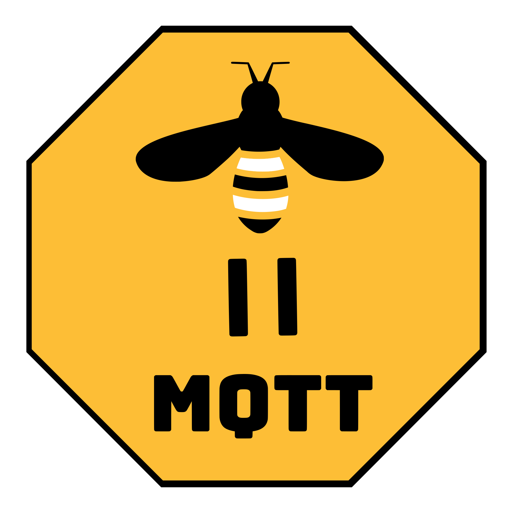
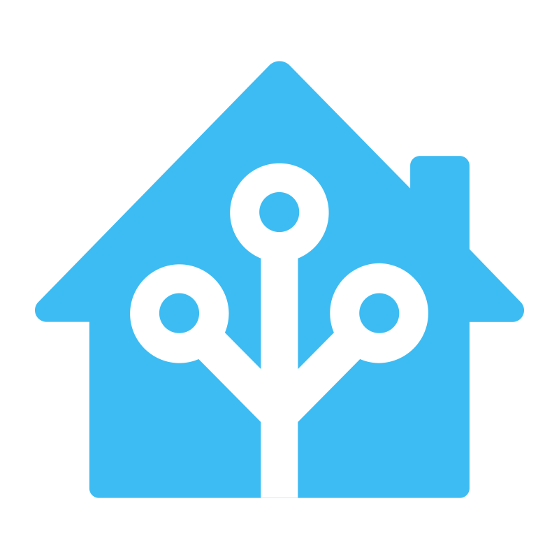

# &nbsp;&nbsp;&nbsp;Matterbridge

[](https://www.npmjs.com/package/matterbridge)
[](https://www.npmjs.com/package/matterbridge)
[](https://hub.docker.com/r/luligu/matterbridge)
[](https://hub.docker.com/r/luligu/matterbridge)


[](https://www.npmjs.com/package/matter-history)
[](https://www.npmjs.com/package/node-ansi-logger)
[](https://www.npmjs.com/package/node-persist-manager)

---

Matterbridge is a Matter plugin manager.

It allows you to have all your Matter devices up and running in a couple of minutes without
having to deal with the pairing process of each single device.

The developer just focuses on the device development extending the provided classes.

Just pair Matterbridge once, and it will load all your registered plugins.

This project aims to allow the porting of homebridge plugins to matterbridge plugins without recoding everything.

It creates a device to pair in any ecosystem like Apple Home, Google Home, Amazon Alexa, or
any other ecosystem supporting Matter like Home Assistant.

You don't need a hub or a dedicated new machine.

No complex setup just copy paste the installation scripts.

Matterbridge is light weight and run also on slow Linux machine with 512MB of memory.

It runs perfectly on macOS and Windows too.

If you like this project and find it useful, please consider giving it a star on GitHub at https://github.com/Luligu/matterbridge and sponsoring it.

<a href="https://www.buymeacoffee.com/luligugithub">
  
</a>

## Acknowledgements

The project is build on top of https://github.com/project-chip/matter.js.

A special thank to Apollon77 for his incredible work.

## Discord

Join us in the Matterbridge Discord group https://discord.gg/QX58CDe6hd created by Tamer (https://github.com/tammeryousef1006).

## Videos

https://www.youtube.com/watch?v=goNB9Cgh_Fk

## Reviews

https://www.matteralpha.com/how-to/how-to-configure-an-open-source-matter-bridge-at-home

## Press

https://matter-smarthome.de/en/interview/an-alternative-to-the-official-matter-sdk/

## Prerequisites

To run Matterbridge, you need either a [Node.js](https://nodejs.org/en) environment or [Docker](https://docs.docker.com/get-started/get-docker/) installed on your system.

If you don't have Node.js already install, please use this method to install it on a debian device: https://github.com/nodesource/distributions.
The supported versions of node are 18, 20 and 22. Please install node 22 LTS.
Node 23 is not supported.
Nvm is not a good choice and should not be used for production.

If you don't have Docker already install, please use this method to install it on a debian device: https://docs.docker.com/desktop/setup/install/linux/debian/.

Since as stated in the Matter specifications "Matter aims to build a universal IPv6-based communication protocol for smart home devices", ipv6 should be enabled in the network.

Avoid using VLAN and firewall blocking the communications between the controller and Matterbridge.

## Installation

Follow these steps to install Matterbridge:

```
npm install -g matterbridge --omit=dev
```

on Linux you may need the necessary permissions:

```
sudo npm install -g matterbridge --omit=dev
```

Test the installation with:

```
matterbridge
```

Now it is possible to open the frontend at the link provided in the log (e.g. http://MATTERBIDGE-IPV4-ADDRESS:8283).

You can then change the bridge mode and other parameters from the frontend.

## Usage

### mode bridge

```
matterbridge -bridge
```

This force Matterbridge to load in bridge mode.

Matterbridge only exposes itself, and you have to pair it scanning the QR code shown in the frontend or in the console.

### mode childbridge

```
matterbridge -childbridge
```

This force Matterbridge to load in childbridge mode.

Matterbridge exposes each registered plugins, and you have to pair each one by scanning the QR code shown in the frontend or in the console.

### Use matterbridge -help to see the command line syntax

```
matterbridge -help
```

## Frontend

Matterbridge has a frontend available on http://MATTERBIDGE-IPV4-ADDRESS:8283 and http://[MATTERBIDGE-IPV6-ADDRESS]:8283

You can change the default port by adding the frontend parameter when you run it.

Here's how to specify a different port number:

```
matterbridge -frontend [port number]
```

To use the frontend with ssl place the certificates in the .matterbridge/certs directory: cert.pem, key.pem and ca.pem (optional).

From the frontend you can do all operations in an easy way.

Home page:


Devices page:
[See the screenshot here](screenshot/Screenshot%20devices.jpg)

Logs page:
[See the screenshot here](screenshot/Screenshot%20logs.jpg)

Config editor:
[See the screenshot here](screenshot/Screenshot%20config%20editor.jpg)

## Advanced configurations

### Run matterbridge as a daemon with systemctl (Linux only)

[Service configurations](README-SERVICE.md)

### Run matterbridge with docker and docker compose

[Docker configurations](README-DOCKER.md)

### Run matterbridge with podman

[Podman configurations](README-PODMAN.md)

### Run matterbridge with nginx

[Nginx configurations](README-NGINX.md)

### Run matterbridge as an home assistant add-on with the official add-on

[Home assistant add-on configurations](https://github.com/Luligu/matterbridge-home-assistant-addon)

### Other Home Assistant Community Add-ons

The other Home Assistant Community Add-ons and plugins are not verified to work with Matterbridge. I strongly advise against using them. If you do use them and encounter an issue (which is likely because some do not meet the Matterbridge guidelines), please do not open an issue in the Matterbridge repository.

## Development

[Development](README-DEV.md)

## Plugins

### Shelly

<a href="https://github.com/Luligu/matterbridge-shelly">
  
</a>

Matterbridge shelly plugin allows you to expose all Shelly Gen 1, Gen 2, Gen 3 and BLU devices to Matter.

Features:

- Shellies are automatically discovered using mDNS.
- Shelly wifi battery-powered devices are supported.
- Shelly wifi battery-powered devices with sleep_mode are supported.
- Shelly BLU devices are supported through local devices configured as ble gateway.
- Discovered shellies are stored in local storage for quick loading on startup.
- The components exposed are Light (with brightness and RGB color), Switch, Relay, Roller, Cover, PowerMeter, Temperature, Humidity, Illuminance, Thermostat, Button and Input.
- PowerMeters expose the electrical measurements with the electricalSensor device type (suppoerted by Home Assistant and partially by SmartThings), waiting for the controllers to upgrade to the Matter 1.3 specs.
- Shellies are controlled locally, eliminating the need for cloud or MQTT (which can both be disabled).
- Shelly Gen 1 devices are controlled using the CoIoT protocol.
- Shelly Gen 2 and Gen 3 devices are controlled using WebSocket.
- The Matter device takes the name configured in the Shelly device's web page.
- Each device can be blacklisted or whitelisted using its name, id or mac address.
- Device components can be blacklisted globally or on a per-device basis.
- If the device has a firmware update available, a message is displayed.
- If the device's CoIoT protocol is not correctly configured, a message is displayed.
- If the device cover/roller component is not calibrated, a message is displayed.
- If a device changes its ip address on the network, a message is displayed and the new address is stored.
- A 10-minute timer checks if the device has reported within that time frame, and fetch un update.

### Zigbee2MQTT

<a href="https://github.com/Luligu/matterbridge-zigbee2mqtt">
  
</a>

Matterbridge zigbee2mqtt is a matterbridge production-level plugin that expose all zigbee2mqtt devices and groups to Matter.

No hub or dedicated hardware needed.

### Somfy tahoma

<a href="https://github.com/Luligu/matterbridge-somfy-tahoma">
  
</a>

Matterbridge Somfy Tahoma is a matterbridge production-level plugin that expose the Somfy Tahoma screen devices to Matter.

### Home Assistant

<a href="https://github.com/Luligu/matterbridge-hass">
  
</a>

Matterbridge Home Assistant plugin allows you to expose the Home Assistant devices and entities to Matter.

It is the ideal companion of the official [Matterbridge Home Assistant Add-on](https://github.com/Luligu/matterbridge-home-assistant-addon/blob/main/README.md).

### Webhooks

<a href="https://github.com/Luligu/matterbridge-webhooks">
  
</a>

Matterbridge Webhooks plugin allows you to expose any webhooks to Matter..

### BTHome

<a href="https://github.com/Luligu/matterbridge-webhooks">
  
</a>

Matterbridge BTHome allows you to expose any BTHome device to Matter using the native bluetooth of the host machine.

Features:

- The bluetooth works correctly on all platforms and is based on the @stoprocent fork of noble.
- The discovered BTHome devices are stored with all attributes to easily restart the plugin.
- The plugin has also a command line to test and verify the bluetooth adapter and the ble network.

### Accessory platform example

This is an example of an accessory platform plugin.

It exposes a virtual cover device that continuously moves position and shows how to use the command handlers (you can control the device).

An Accessory platform plugin only exposes one device.

[See the plugin homepage here](https://github.com/Luligu/matterbridge-example-accessory-platform)

### Dynamic platform example

This is an example of a dynamic platform plugin.

It exposes 38 devices:

- a switch with onOff cluster
- a light with onOff
- a light with onOff and levelControl (dimmer)
- a light with onOff, levelControl and colorControl (with XY, HS and CT) clusters
- a light with onOff, levelControl and colorControl (with HS and CT) clusters
- a light with onOff, levelControl and colorControl (with XY and CT) clusters
- a light with onOff, levelControl and colorControl (with CT only) clusters
- an outlet (plug) with onOff cluster
- a cover with windowCovering cluster
- a lock with doorLock cluster
- a thermo autoMode (i.e. with Auto Heat and Cool features) with thermostat cluster and 3 sub endpoints with flowMeasurement cluster, temperatureMeasurement cluster
  and relativeHumidityMeasurement cluster (to show how to create a composed device with sub endpoints)
- a thermo heat only with two external temperature sensors (tagged like Indoor and Outdoor)
- a thermo cool only
- a fan with FanControl cluster
- a rainSensor device
- a waterFreezeDetector device
- a waterLeakDetector device
- a smokeCoAlarm (with smoke and co features) sensor (supported by Apple Home)
- a smokeCoAlarm (with smoke only feature) sensor (supported by Apple Home)
- a smokeCoAlarm (with co only feature) sensor (supported by Apple Home)
- an airConditioner device
- an airPurifier device with temperature and humidity sensor (supported by Apple Home)
- a pumpDevice device
- a waterValve device
- an airQuality device with all concentration measurements clusters (supported by Apple Home only without the concentration measurements)
- a momentary switch
- a latching switch
- a Robot Vacuum Cleaner device (supported by SmartThings, Alexa, Home Assistant and partially by Apple Home). Read also https://github.com/Luligu/matterbridge/discussions/264.
- a onOff Mounted Switch device (supported by SmartThings, Alexa, Home Assistant)
- a dimmer Mounted Switch device (supported by SmartThings, Alexa, Home Assistant)
- a laundry Washer device (supported by SmartThings, Alexa and Home Assistant)
- a laundry Dryer device (supported by SmartThings, Alexa and Home Assistant)
- a dishwasher device (supported by SmartThings, Alexa and Home Assistant)
- a refrigerator device (supported by SmartThings, Alexa and Home Assistant)
- an oven device (supported by SmartThings, Alexa and Home Assistant)
- a microwave Oven device (supported by SmartThings, Alexa and Home Assistant)
- an extractor Hood device (supported by SmartThings, Alexa and Home Assistant)
- a cooktop device (supported by SmartThings, Alexa and Home Assistant)

All these virtual devices continuously change state and position. The plugin also shows how to use all the command handlers (you can control all the devices).

A Dynamic platform plugin exposes as many devices as you need (the limit for the Home app is 150 accessories for bridge).

[See the plugin homepage here](https://github.com/Luligu/matterbridge-example-dynamic-platform)

### Example plugins to show the usage of history in matter

[Door plugin with history](https://github.com/Luligu/matterbridge-eve-door)

[Motion plugin with history](https://github.com/Luligu/matterbridge-eve-motion)

[Energy plugin with history](https://github.com/Luligu/matterbridge-eve-energy)

[Weather plugin with history](https://github.com/Luligu/matterbridge-eve-weather)

[Room plugin with history](https://github.com/Luligu/matterbridge-eve-room)

The history works in both bridge and childbridge mode.

The Eve app only shows the history when the plugins run like an AccessoryPlatform in childbridge mode (this means the plugin is paired directly).

## Third-party plugins

### [Loxone](https://github.com/andrasg/matterbridge-loxone)

A matterbridge plugin that allows connecting Loxone devices to Matter.

## How to install and add a plugin with the frontend (best option)

Just open the frontend on the link provided in the log, select a plugin and click install.

## How to install and add a plugin manually from a terminal (from npm)

To install i.e. https://github.com/Luligu/matterbridge-zigbee2mqtt

On windows:

```
cd $HOME\Matterbridge
npm install -g matterbridge-zigbee2mqtt
matterbridge -add matterbridge-zigbee2mqtt
```

On linux:

```
cd ~/Matterbridge
sudo npm install -g matterbridge-zigbee2mqtt
matterbridge -add matterbridge-zigbee2mqtt
```

## How to add a plugin to Matterbridge from a terminal

```
matterbridge -add [plugin path or plugin name]
```

## How to remove a plugin from Matterbridge from a terminal

```
matterbridge -remove [plugin path or plugin name]
```

## How to disable a registered plugin from a terminal

```
matterbridge -disable [plugin path or plugin name]
```

## How to enable a registered plugin from a terminal

```
matterbridge -enable [plugin path or plugin name]
```

## How to remove the commissioning information for Matterbridge so you can pair it again (bridge mode). Shutdown Matterbridge before!

```
matterbridge -reset
```

## How to remove the commissioning information for a registered plugin so you can pair it again (childbridge mode). Shutdown Matterbridge before!

```
matterbridge -reset [plugin path or plugin name]
```

## How to factory reset Matterbridge. Shutdown Matterbridge before!

```
matterbridge -factoryreset
```

This will reset the internal storages. All commissioning informations will be lost. All plugins will be unregistered.

# Frequently asked questions

## How to enable HTTPS for the frontend

### Provide your own certificates

Place your own certificates in the `.matterbridge/cert` directory:

- `cert.pem`
- `key.pem`
- `ca.pem` (optional)


### Change the command line

Add the **-ssl** parameter to the command line. If desired, you can also change the frontend port with **-frontend 443**.

```sh
matterbridge -ssl -frontend 443
```

### Restart

If the certificate are correctly configured, you will be able to connect with https to the frontend.


## How to send the debug log files

### Enable debug and log on file

In the frontend, go to settings and enable debug mode as shown below:


### Restart

Wait a few minutes to allow the logs to to accumulate.

Then, from the dots menu in the frontend, download the `matterbridge.log` and `matter.log` files.


# Known general issues

## Session XYZ does not exist or Cannot find a session for ID XYZ

This message may appear after Matterbridge restarts, indicating that the controller is still using a session from the previous connection that has since been closed.
After some time, the controller will reconnect.
In this context, the message is not indicative of a problem.

## Apple Home

The HomePods, being a WiFi devices, sometimes pruduce message trasmission errors. The Apple TV with network cable is more reliable (but also more expensive).

All issues have been solved from the version 17.5 of the HomePod/AppleTV. Now they are stable.

If you have more then one Apple TV or Home Pod, you can herve better results setting to disabled "Automatic Selection" in "Home Setting", "Home Hubs & Bridges". When "Automatic selection" is disabled, select your Apple Tv if you have one or any of your Home Pod. In this way you should not have anymore more then one session for fabric.

### Manufacturer Serial Number and Model

The Home app forgets about them when you restart the node.

### Appliances

As of version 18.4.x, all Appliances device types are not supported by the Home app. They don't even appear like unsupported accessories.

### Robot

As of version 18.4.x, the Robot is supported by the Home app only as a single, non-bridged device or if it is the only device in the bridge.

If a Robot is present alongside other devices in the bridge, the entire bridge becomes unstable in the Home app.

### Concentration measurements clusters

As of version 18.4.x, all cluster derived from the concentration measurement cluster hang the Home app while pairing and the entire bridge becomes unstable in the Home app.

For example: air quality sensors with TVOC measurement or co sensors with CarbonMonoxide measurement.

## Home Assistant

So far is the only controller supporting some Matter 1.2, 1.3 and 1.4 device type:

- airQualitySensor code 0x002c (Matter 1.2)
- smokesmokeCoAlarm code 0x0076 (Matter 1.2)
- waterFreezeDetector code 0x0041 (Matter 1.3 with only BooleanState cluster)
- waterLeakDetector code 0x0043 (Matter 1.3 with only BooleanState cluster)
- rainSensor code 0x0044 (Matter 1.3 with only BooleanState cluster)
- deviceEnergyManagement code 0x050d (Matter 1.3 with only DeviceEnergyManagementMode cluster)

Electrical measurements:

- electrical measurements from EveHistoryCluster (used in old Matterbridge plugins)
- electricalSensor code 0x0510 with clusters: ElectricalPowerMeasurement and ElectricalEnergyMeasurement

Other supported cluster:

- modeSelect code 0x27 with ModeSelect cluster

## Home Assistant issues (Matter Server for HA is still in Beta)

- If HA doesn't show all devices, reload the Matter Server Integration or reboot HA
- Home Assistant doesn't seem to always react when a device is removed from the bridge: they remain in HA unavailable forever...
- Use Apple Home when you have to choose the controller type even if you pair Matterbridge directly with HA.

## Google Home

If you face a problem pairing to Google Home from Ios app the solution is there https://github.com/Luligu/matterbridge/issues/61.

If you face a problem changing the brightness check this for the explanation: https://github.com/Luligu/matterbridge-zigbee2mqtt/issues/80

No other issues reported so far.

## Alexa

Tested by Tamer Salah

Alexa needs the standard port 5540 to pair (from matter.js readme).

There is no support for these Matter device types:

- pressure sensor
- flow sensor

In the zigbee2mqtt and shelly plugins select the option to expose
the switch devices like light or outlet cause they don't show up like switch
(Matterbridge uses a modified switch device type without client cluster).

## SmartThings

Tested by Tamer Salah

No issues reported so far.

Supports also:

- air Quality Sensor (Matter 1.2)
- smoke Co Alarm

## eWeLink

Tested by Tamer Salah

eWeLink needs the standard port 5540 for commissioning.

## Tuya/Smart Life

Check the matter.js readme.

## Code of Conduct

We believe in a welcoming and respectful community for all. Please make sure to follow our [Code of Conduct](LINK_TO_CODE_OF_CONDUCT) in all your interactions with the project.

## Support

If you find this project helpful and you wish to support the ongoing development, you can do so by buying me a coffee.
On my side I sponsor the packages that I use in this project. It would be nice to have sponsors too.
Click on the badge below to get started:

<a href="https://www.buymeacoffee.com/luligugithub">
  
</a>

Thank you for your support!
