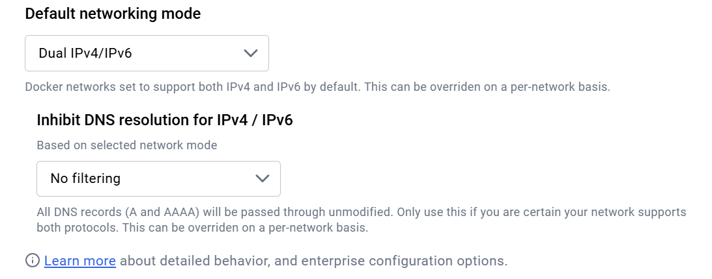
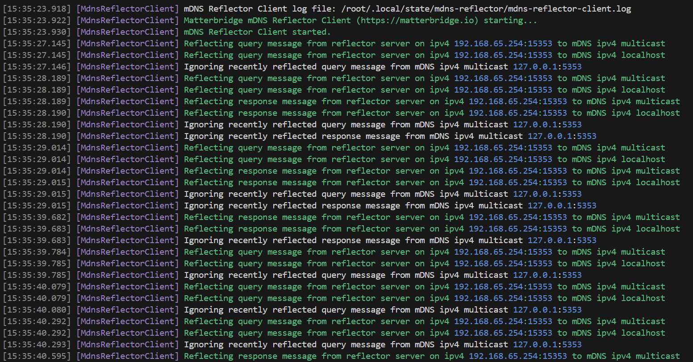

# Prerequisites

- Docker Desktop

## Dual Stack IPv4/IPv6 mDNS enabled and No filtering



# Run Matterbridge in a Docker Desktop container

We use named volumes for storage, plugins and mattercert.

We use matter port range 5550-5559 to allow childbridge mode and server node devices (RVCs).

```bash
docker run -dit --name matterbridge-test \
  -p 8283:8283 -p 5550-5559:5550-5559/udp \
  -v storage:/root/.matterbridge -v plugins:/root/Matterbridge -v mattercert:/root/.mattercert \
  luligu/matterbridge:latest matterbridge --docker --port 5550
docker logs --tail 1000 -f matterbridge-test
```

```powershell
docker run -dit --name matterbridge-test `
  -p 8283:8283 -p 5550-5559:5550-5559/udp `
  -v storage:/root/.matterbridge -v plugins:/root/Matterbridge -v mattercert:/root/.mattercert `
  luligu/matterbridge:latest matterbridge --docker --port 5550
docker logs --tail 1000 -f matterbridge-test
```

You will see that the frontend inside the container is listening on the conainer address

```text
[09:02:10.140] [Frontend] The frontend http server is listening on http://172.17.0.2:8283
[09:02:10.140] [Frontend] The frontend http server is listening on http://[fd3d:8954:ffe5::2]:8283
```

But since we mapped the port 8283, the frontend is available on the host with localhost your host ip or hostname and on the lan with your host ip or hostname.

In the same way the Matter port range 5550-5559 is mapped outside the container.

## Optional: if you want to see what happens inside a Docker Desktop container

From another terminal run mb_mdns inside the container we created and run before

```bash
docker exec -it matterbridge-test mb_mdns --no-timeout
```

In a while you will see what Matterbridge mDNS packet advertised from the Docker Desktop container


## Optional: if you want to see ip and routing table inside the container

From another terminal run ip a and ip r inside the container we created and run before

```bash
docker exec -it matterbridge-test apt-get update
docker exec -it matterbridge-test apt-get install -y --no-install-recommends iproute2 iputils-ping net-tools dnsutils tcpdump netcat-openbsd
docker exec -it matterbridge-test ip a
docker exec -it matterbridge-test ip r
```

### Issues we have there

1. The advertised mDNS cannot reach the host and the lan cause mDNS are not routed inside Docker Desktop

2. The advertised mDNS packet contains wrong A and AAAA records:

- the advertised address are relative to the container
- those address are not reachable from the host and from the lan

## Run the Madderbridge reflector client in the container we created and run before

```powershell
docker exec -it matterbridge-test mb_mdns --reflector-client
```

In a while you will see



## Run the Madderbridge reflector server on the host

```powershell
npm install -g matterbridge
mb_mdns --reflector-server --log-reflector-messages
```

In a while you will see


# Run Home Assistant and Matter Server in Docker compose with Docker Desktop

Use the [docker-compose.yml](https://github.com/Luligu/matterbridge/blob/dev/docker-reflector/docker-compose.yml) in the docker-reflector directory.

```powershell
docker compose up -d
```

## Optional: if you want to see all mDNS inside a Docker Desktop container with compose

docker logs --tail 1000 -f mb_mdns

## Optional: if you want to see the reflector client inside a Docker Desktop container with compose

docker logs --tail 1000 -f mb_reflector

When asked by Home Assistant connect to Matter Server with **ws://matterserver:5580/ws**
