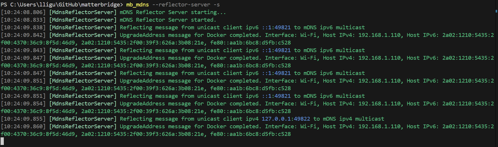

# Matterbridge mDNS reflector

This project aims to use Matterbridge in these configurations:

| Docker type    | Docker network | OS      | Ipv4 | Ipv6 | Share (3) | Home Assistant | Matter Server |
| -------------- | -------------- | ------- | ---- | ---- | --------- | -------------- | ------------- |
| Docker Desktop | bridge (1)     | Windows | ✅   | ✅   | ✅        | ✅             | ✅            |
| Docker Desktop | bridge (1)     | macOS   | ✅   | ✅   | ✅        | ✅             | ✅            |
| Docker Engine  | bridge (2)     | Linux   | ✅   | ✅   | ✅        | ✅             | ✅            |

(1) - Network host in this configuration is useless cause Docker runs inside a VM.

(2) - Network host in this configuration works already out of the box cause Docker runs on the host.

(3) - Share mDNS between separate containers.

It can also be used to run Home Assistant and Matter Server inside Docker Desktop on Windows and macOS (with network bridge) without using complex VM. You just copy paste this [docker-compose.yml](https://matterbridge.io/reflector/docker-compose.yml).

Since the mDNS are shared between reflector clients, you can pair Matterbridge running with Docker Desktop to Home Assistant running with Docker Desktop. Even on the same machine.

<a href="https://www.buymeacoffee.com/luligugithub"></a>

# Prerequisites

- Docker Desktop

## Docker Desktop requirements for Windows and macOS

See Docker Desktop docs.

## Dual Stack IPv4/IPv6 mDNS enabled and No filtering


# Run Matterbridge in a Docker Desktop container

We use named volumes for storage, plugins and mattercert.

We publish the default matterbridge frontend port 8283.

We publish the matter port range 5550-5559 to allow childbridge mode and server node devices (RVCs).

macOS

```zsh
docker stop matterbridge-test
docker rm matterbridge-test
docker pull luligu/matterbridge:dev
docker run -dit --restart unless-stopped --name matterbridge-test \
  -p 8283:8283 -p 5550-5559:5550-5559/udp \
  -v storage:/root/.matterbridge -v plugins:/root/Matterbridge -v mattercert:/root/.mattercert \
  luligu/matterbridge:dev matterbridge --docker --frontend 8283 --port 5550
docker logs --tail 1000 -f matterbridge-test
```

powerShell

```powershell
docker stop matterbridge-test
docker rm matterbridge-test
docker pull luligu/matterbridge:dev
docker run -dit --restart unless-stopped --name matterbridge-test `
  -p 8283:8283 -p 5550-5559:5550-5559/udp `
  -v storage:/root/.matterbridge -v plugins:/root/Matterbridge -v mattercert:/root/.mattercert `
  luligu/matterbridge:dev matterbridge --docker --frontend 8283 --port 5550
docker logs --tail 1000 -f matterbridge-test
```

You will see that the frontend inside the container is listening on the conainer address

```text
[09:02:10.140] [Frontend] The frontend http server is listening on http://172.17.0.2:8283
[09:02:10.140] [Frontend] The frontend http server is listening on http://[fd3d:8954:ffe5::2]:8283
```

But since we mapped the port 8283:

- the frontend is available on the host with localhost:8283, <your_host_ip>:8283 or <your_hostname>:8283.

- the frontend is available on the lan with <your_host_ip>:8283 or <your_hostname>:8283.

In the same way the Matter port range 5550-5559 is mapped outside the container to allow the controllers on the lan to discover and connect Matterbridge.

## Optional: if you want to see the mDNS inside the Docker Desktop container

From another terminal run mb_mdns inside the container we created and run before

```bash
docker exec -it matterbridge-test mb_mdns --no-timeout
```

In a while you will see what mDNS packets are advertised inside the container


## Optional: if you want to see ip and routing table inside the Docker Desktop container

From another terminal run ip a and ip r inside the container we created and run before

```bash
docker exec -it matterbridge-test apt-get update
docker exec -it matterbridge-test apt-get install -y --no-install-recommends iproute2 iputils-ping net-tools dnsutils tcpdump netcat-openbsd
docker exec -it matterbridge-test ip a
docker exec -it matterbridge-test ip r
```

### Issues we have there

1. The advertised mDNS packets cannot reach the host and the lan cause mDNS are not routed inside Docker Desktop

2. The advertised mDNS packets contain wrong A and AAAA records:

- the advertised address are relative to the container
- those address are not reachable from the host and from the lan

## Run the Madderbridge reflector server directly on the host (you need node.js installed on Windows or macOS)

```shell
npm install -g matterbridge@dev
mb_mdns --reflector-server --log-reflector-messages --localhost --share-with-clients
```

In a while you will see



## Run the Madderbridge reflector client in container

```shell
docker stop matterbridge-reflector
docker rm matterbridge-reflector
docker pull luligu/reflector-client:latest
docker run -dit --restart unless-stopped --name matterbridge-reflector luligu/reflector-client:latest
docker logs --tail 1000 -f matterbridge-reflector
```

In a while you will see


# Run Home Assistant and Matter Server in Docker compose with Docker Desktop

## Prerequisites

You need the Matterbridge reflector server running on the host from the tutorial above.

## Run Home Assitant and Matter Server in Docker Compose with Docker Desktop

To test the sharing feature (it shares mDNS between all reflector clients),
use this [docker-compose.yml](https://matterbridge.io/reflector/docker-compose.yml).

With this configuration Home Assistant (with Matter Server) works inside a Docker Desktop container without network host. When asked by Home Assistant, connect to Matter Server with **ws://matterserver:5580/ws**

```shell
docker compose down
docker compose pull
docker compose up -d --force-recreate
docker logs --tail 1000 -f reflector
```
